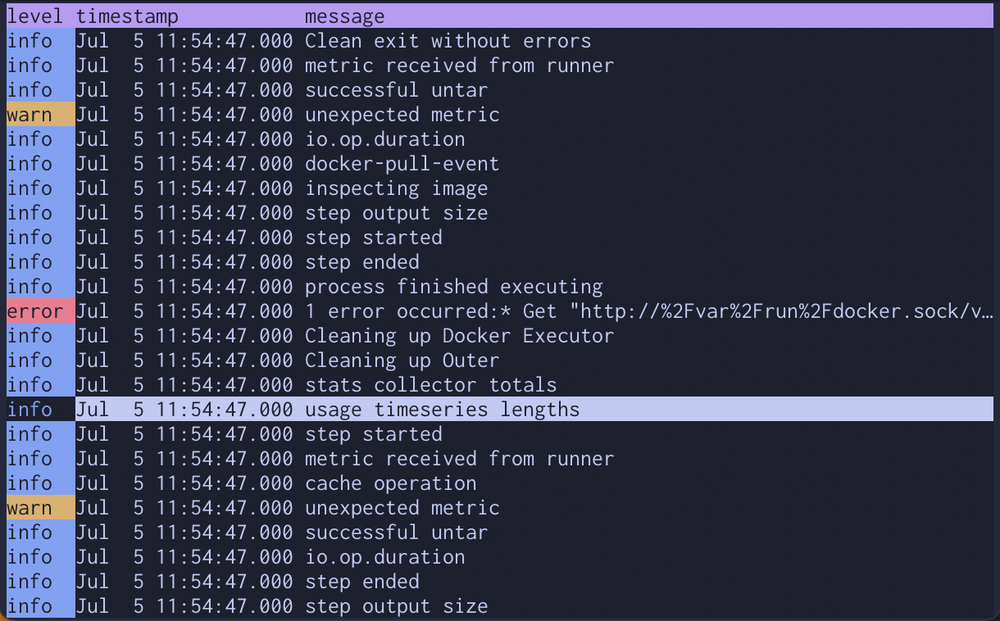

# ltop

A terminal-based log viewer inspired by top/htop.



## Prerequisites

- [Go](https://go.dev/) >= 1.20
- [Task](https://taskfile.dev/)

## Build

```sh
task build
```

## Test

```sh
task test
```
